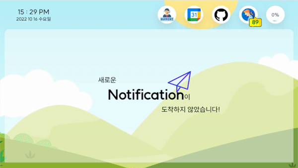
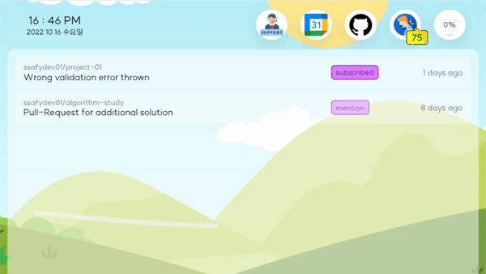
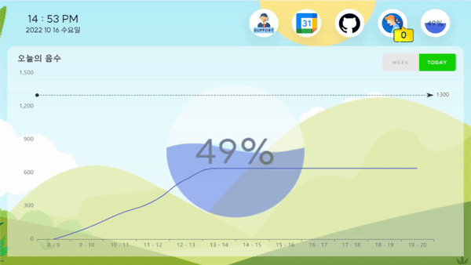
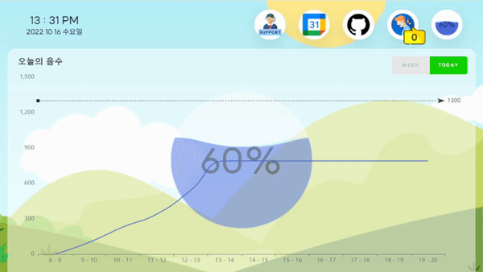
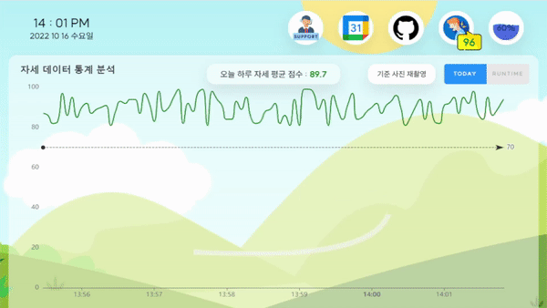
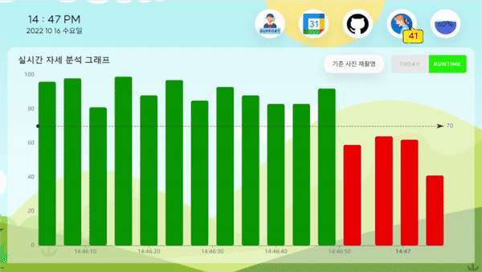
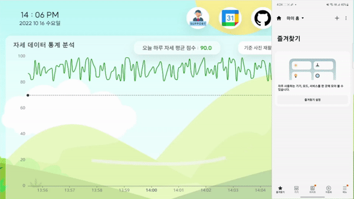

# Boxthing


## 🎥 서비스 소개 영상

[](https://www.youtube.com/watch?v=dtN5zS2B7Eo)
※ 클릭하면 넘어갑니다!

## 💡 개발자를 위한 IoT 스마트 박스 📦

📅 `Google Calendar` 일정 확인 및 알림

🔊 연동된 `Github` 계정 알림 확인

🥛 사용자의 일일 및 주간 `음수량` 추이 확인

🙋🏼‍♂️ 사용자의 `앉아있는 자세` 실시간 확인 후 점수화

🧘🏼 업무도 쉬면서! `스트레칭 정보` 제공

❄️ `Samsung Smart Things` 연동, 먼 거리 기기 조작 가능

## 📁 File Structure

`master`

```jsx
|--back
|--docs // presentation files
|--front
|--hw
```

## 🏗️ Total Architecture


## ⌨️ Tech Stacks

### Environment

- OS : Windows 10
- IDE
  - VS Code
  - IntelliJ
- DB : Maria DB

### BE

- Java 17
- JDK 17.0.3
- Spring Boot 2.7.3
- Gradle

### FE

- react 18.2.0
- recoil 0.7.6
- react-webcam: 7.0.1
- react-router-dom: 6.4.2
- echarts-for-react: 3.0.2

### HW

-
-
-

## 📺 ScreenShot

📅 Google Calendar 일정 확인 및 알림



- 임박한 일정(20분 내), 진행 중인 일정, 오늘의 일정 확인 가능
- 임박한 일정 발생 시, 페이지가 자동으로 이동되어 빠른 내용 확인 가능

🔊 연동된 `Github` 계정 알림 확인



- 읽지 않은 알림 발생 시, 페이지가 자동으로 이동되어 빠른 내용 확인 가능
- 다른 페이지 이동 시, 자동으로 읽음 처리 및 상태 연동

🥛 사용자의 일일 및 주간 `음수량` 추이 확인



- 음수 시 음수량 확인 및 시간대별 음수 추이 확인 가능



- 최근 15일간의 총 음수량 확인 가능

🙋🏼‍♂️ 사용자의 `앉아있는 자세` 실시간 확인 후 점수화


- 자세 측정 점수의 기준이 되는 사진을 측정 전에 촬영



- 일정한 간격으로 자세 점수를 측정하여 시각화
- 71점 이상일 경우 좋은 자세로 판단



- 70점 이하일 경우 안좋은 자세로 판단하여 알림을 통해 자세 교정을 권고

🧘🏼 업무도 쉬면서! `스트레칭 정보` 제공


- 음성 명령어를 통해 약 10가지 스트레칭 정보 제공

❄️ `Samsung Smart Things` 연동, 먼 거리 기기 조작 가능



- 삼성 SmartThings 스펙에 맞추어 서드파티 제품으로 제작되었기 때문에 삼성 SmartThings 어플리케이션을 통해 언제 어디서든 기기 조작이 가능

## 🗨️ Communication Tools

- JIRA
- Mattermost
- Gitlab
- [Notion](https://www.notion.so/00d5db4b515043539bf3ef8fb3dc2e16)
  - 더 많은 정보를 위해 노션을 방문해보세요

## 👩‍👩‍👧‍👧 Members

| Name   | Email              | Position |
| ------ | ------------------ | -------- |
| 김지인 |                    |          |
| 윤경식 | didnlie@naver.com  | FE       |
| 정재훈 |                    |          |
| 한동현 |                    |          |
| 홍인표 | ypd02363@naver.com | BE       |
