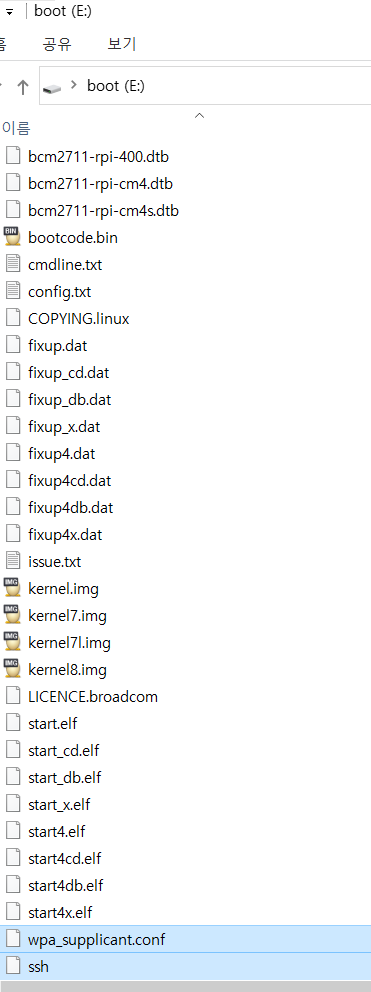

# RPI Setting

## 준비물

- 라즈베리파이
- SD 카드
- SD카드 리더기
- (선택) LCD 모니터, HTML 케이블, 마우스, 키보드

## 라즈비안 설치

### 1. SD 카드를 포멧시키자!

윈도우에서 SD카드를 장착하면 포멧하겠냐는 알림창을 통해 포멧을 시킬 수 있다. 만약 해당 알림창이 발생하지 않을경우 해당 [사이트](https://www.sdcard.org/downloads/formatter/sd-memory-card-formatter-for-windows-download/)를 통해 포멧시키자!

### 2. 라즈비안 설치

[https://www.raspberrypi.com/software/](https://www.raspberrypi.com/software/)에서 라즈비안 설치 가능하다.

- 라즈비안 : 라즈베리 OS를 편리하게 설치가능하게 해주는 툴

### 3. 라즈비안 사용법

라즈비안을 실행시키면, `운영체제`와 `저장소`를 선택하여 설치할 수 있다.

- 운영체제 : 32-bit / 64-bit / legacy 등 다양한 버전의 OS를 설치할 수 있다.
- 저장소 : SD 카드를 포멧시켰기 때문에, SD카드 리더기를 통해 SD카드에 라즈베리파이 OS를 설치하자!

## 인터넷 연결

- 라즈베리파이에 직접 `랜선`을 연결하면 아무 셋팅없이 인터넷을 연결할 수 있다.

## 디스플레이 없이 무선랜 설정

- SD 카드에 [ssh](./ssh)& [wpa_supplicant.conf](./wpa_supplicant.conf) 추가하기



### wpa_supplicant.conf

- 본인이 연결할 무선랜 정보를 입력해준다.
- 무선랜이 핫스팟일 때 가장 편하다.

```
ctrl_interface=DIR=/var/run/wpa_supplicant GROUP=netdev
update_config=1
country=KR

network={
    ssid="와이파이SSID"
    psk="와이파이비밀번호"
    key_mgmt=WPA-PSK
}
```

- SD카드에 추가 후 SD카드를 제거 후 라즈베리파이에 장착시켜준다.

## IP 알아내기

### 제일 쉬운 방법(핫스팟)

- 방법 1) 본인 핸드폰에서 모바일 핫스팟을 켜서, 컴퓨터와 RPI를 같이 잡아주면, 모바일에서 연결된 장치의 IP를 바로 확인할 수 있다.
- 방법 2) 컴퓨터에서 네트트워크 설정에서 모바일 핫스팟을 켜준다. 핸드폰과 동일하게 IP를 확인할 수 있다. [참고](https://blog.naver.com/PostView.nhn?blogId=makeitall018&logNo=221850190040&categoryNo=44&parentCategoryNo=0)

### 핫스팟 아닐 경우

- 핫스팟이 아닐 경우, 일일히 찾아야 한다.
- RPI에 할당된 IP를 찾기 위해 도와주는 툴이 존재한다. [IP 찾기 툴](https://www.advanced-ip-scanner.com/kr/)
- 찾고자 하는 범위를 입력하여 스캔하고, 제조업체가 Raspberry Pi 인 IP를 찾자 [참고](https://elansk.tistory.com/m/106)
- 잘 안된다면 [다른 툴](https://jow1025.tistory.com/m/275)도 사용해보자.

## SSH 연결

- IP를 알아냈다면, [Mobaxterm](https://mobaxterm.mobatek.net/download-home-edition.html)을 통해 연결해보자.
- Session > SSH에서 다음과 같이 설정


- OK 후 비밀번호(초기:raspberry)로 접속하면 성공

## VNC 연결

### VNC Enable 설정

```java
sudo raspi-config
Interfaceing options > VNC > Yes
sudo reboot
```

### VNC 설치

- VNC 다운로드 : [https://www.realvnc.com/en/connect/download/viewer/](https://www.realvnc.com/en/connect/download/viewer/)
- Windows 버전 다운로드 후 RPI IP 입력합니다.

### 에러 & 해결

- 에러 : Cannot currently show the desktop
- 해결 : 해상도를 설정해주자

```java
sudo raspi-config
2. Display Options > Resolution
```

## 고정 IP일 시 연결 방법(테스트 해봐야 함)

- 보통 공용 WIFI 사용 시 개인 별로 IP가 할당되어 사용하는 경우 있는데, 이때 RPI 연결 방법이 달라진다.
- 우선, SSH로 접속된 환경에서 편집기를 통해 ip 파일 설정해주기
- nano가 편하면 그냥 써도 되지만, 본인은 vim이 편하므로 vim을 설치해준다.

```java
sudo apt install vim -y
```

- vim 설치 후

```java
sudo vi /etc/dhcpcd.conf
```

- #interface eth0 문단 뒤에 다음 내용 추가

```java
interface wlan0
static ip_address=내IP주소/24
static routers= 게이트웨이주소
static domain_name_servers= DNS 주소
//static netmask= 서브넷 마스크
```

- 상단 WIFI와 동일하게 고정 IP 설정된 WIFI를 연결시킨다.
- SSH로 접속해보자.

### 테스트

- 오프라인 때는 고정 IP이므로, 집에서의 개발환경과 다르다.
- 연결 순서
  1. 우선 모바일 핫스팟을 이용하여 ssh로 연결 후, /etc/dhcpcd.conf를 수정해준다.
  2. sd카드 제거 후, wpa_supplicant.conf를 수정해준다.
  3. sd카드 장착 후 부팅 후 ssh 연결해보자.
  4. 아마 IP는 고정 IP의 앞 3자리는 동일할것이다.
     1. ex) 고정 IP : 111.222.333.145 , RPI IP : 111.222.333.???
     2. 따라서, ip scanner을 통해 해당 범위를 찾아보자.
